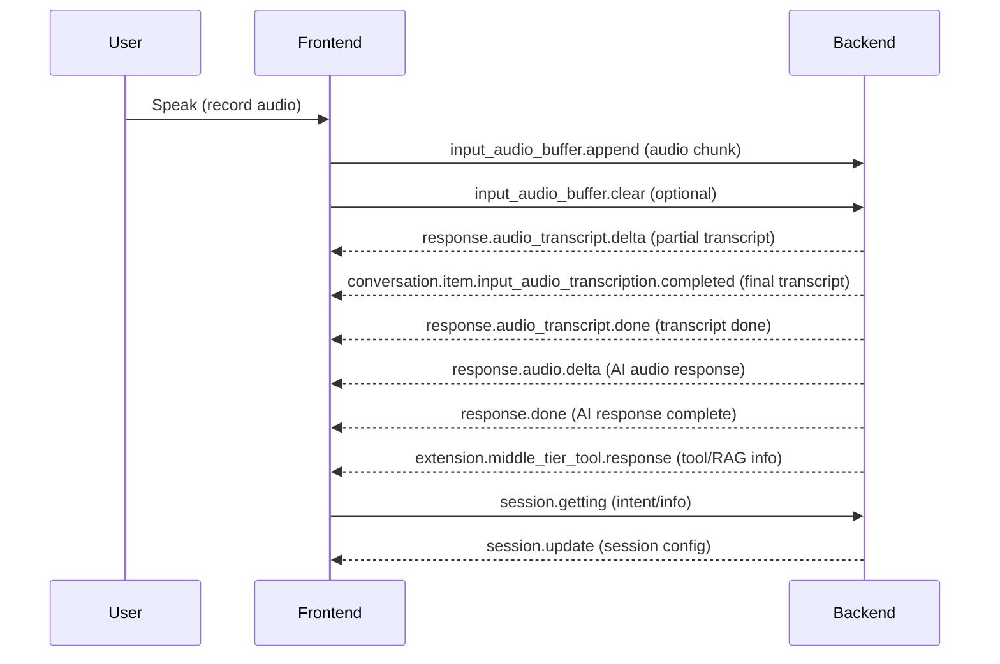

# Auto Call Center OpenAI Realtime

A full-stack project for a real-time, AI-powered call center using OpenAI, Node.js backend, and a modern React (Vite) frontend.

## Features

- Real-time audio streaming and transcription
- AI agent routing and intent recognition
- RAG (Retrieval-Augmented Generation) tools
- Multi-language support (i18n)
- Modular frontend and backend structure

---

## Prerequisites

- Node.js (v18+ recommended)
- npm (v9+ recommended)
- (Optional) PM2 for backend process management

---

## Project Structure

```
backend-node/      # Node.js backend (Fastify, WebSocket, Azure, LangChain)
frontend/          # React + Vite frontend (TypeScript, TailwindCSS)
```

---

## 1. Setup Instructions

### 1.1. Clone the Repository

```sh
git clone <your-repo-url>
cd auto-call-center-openai-realtime
```

### 1.2. Install Dependencies

#### Backend

```sh
cd backend-node
npm install
```

#### Frontend

```sh
cd ../frontend
npm install
```

---

## 2. Environment Variables

### Backend

Create a `.env` file in `backend-node/` with the following (example):

```
OPENAI_API_KEY=your_openai_api_key
AZURE_SEARCH_KEY=your_azure_search_key
AZURE_SEARCH_ENDPOINT=your_azure_search_endpoint
# Add other required environment variables as needed
```

---

## 3. Running the Application

### 3.1. Start Backend

```sh
cd backend-node
npm run dev
```

### 3.2. Start Frontend

```sh
cd frontend
npm run dev
```

The frontend will be available at `http://localhost:5173` (default Vite port).

---

## 4. Build for Production

### Backend

```sh
cd backend-node
# (Add build steps if needed)
```

### Frontend

```sh
cd frontend
npm run build
```

---

## 5. Project Details

### Backend

- Fastify server with WebSocket support
- Integrates with Azure Search and OpenAI
- Modular agent routing (see `backend-node/agents/`)
- RAG tools in `backend-node/ragtools.js`

### Frontend

- React + Vite + TypeScript
- TailwindCSS for styling
- Audio recording and playback components
- i18n support (see `frontend/locales/`)

---

## 6. Customization & Extending

- Add new agents: `backend-node/agents/`
- Add new prompts: `backend-node/knowledge/prompts/`
- Add new retrievers: `backend-node/knowledge/retrievers/`
- Customize UI: `frontend/src/components/`

---

## 7. Troubleshooting

- Ensure all environment variables are set correctly
- Check backend logs for errors
- If ports are in use, update the port in backend or frontend configs

---

## 8. License

MIT License

---

## 9. Credits

- OpenAI
- Azure Cognitive Search
- LangChain
- Vite, React, TailwindCSS

---

---

## 10. Call Sequence Flow & Audio Events Reference

This section describes the detailed sequence of audio-related events exchanged between the frontend and backend during a call session. These events enable real-time audio streaming, transcription, and AI response.

### Typical Call Flow

1. **Session Initialization**

   - Frontend connects to backend via WebSocket.
   - Backend may send a `session.update` event to configure session parameters (e.g., VAD, transcription model).

2. **User Audio Input**

   - Frontend records audio and sends it in chunks:
     - `input_audio_buffer.append`: Sends a base64-encoded audio chunk to backend.
     - `input_audio_buffer.clear`: (Optional) Clears the current audio buffer on backend.

3. **Transcription & Processing**

   - Backend processes audio and may send:
     - `response.audio_transcript.delta`: Partial transcript updates (real-time as audio is processed).
     - `conversation.item.input_audio_transcription.completed`: Final transcript for a user audio segment.
     - `response.audio_transcript.done`: Indicates transcript is complete for a segment.

4. **AI Response Generation**

   - Backend generates a response and streams audio back:
     - `response.audio.delta`: Streams audio data (base64-encoded) for playback.
     - `response.done`: Indicates the AI response is complete (may include transcript and metadata).

5. **Tool/Knowledge Integration**

   - If the AI uses tools (e.g., RAG search), backend may send:
     - `extension.middle_tier_tool.response`: Contains tool results and sources used for the answer.

6. **Session/Intent Updates**
   - Frontend or backend may send session or intent updates:
     - `session.update`: Update session parameters.
     - `session.getting`: (Frontend) Sends user intent and info to backend.

---

### Audio Event Types Reference

| Event Type                                              | Direction          | Description                                     |
| ------------------------------------------------------- | ------------------ | ----------------------------------------------- |
| `session.update`                                        | Backend → Frontend | Session config (VAD, transcription model, etc.) |
| `input_audio_buffer.append`                             | Frontend → Backend | Send audio chunk (base64)                       |
| `input_audio_buffer.clear`                              | Frontend → Backend | Clear audio buffer                              |
| `response.audio.delta`                                  | Backend → Frontend | Streamed audio response (base64)                |
| `response.audio_transcript.delta`                       | Backend → Frontend | Partial transcript update                       |
| `conversation.item.input_audio_transcription.completed` | Backend → Frontend | Final transcript for audio segment              |
| `response.audio_transcript.done`                        | Backend → Frontend | Transcript complete for segment                 |
| `response.done`                                         | Backend → Frontend | AI response complete                            |
| `extension.middle_tier_tool.response`                   | Backend → Frontend | Tool/RAG result info                            |
| `session.getting`                                       | Frontend → Backend | User intent and info                            |

---

---

## 11. Call Sequence Flow Diagram

Below is a sequence diagram visualizing the main audio event flow between the frontend and backend:



> You can view this diagram rendered in supported Markdown viewers or with Mermaid Live Editor.

---
